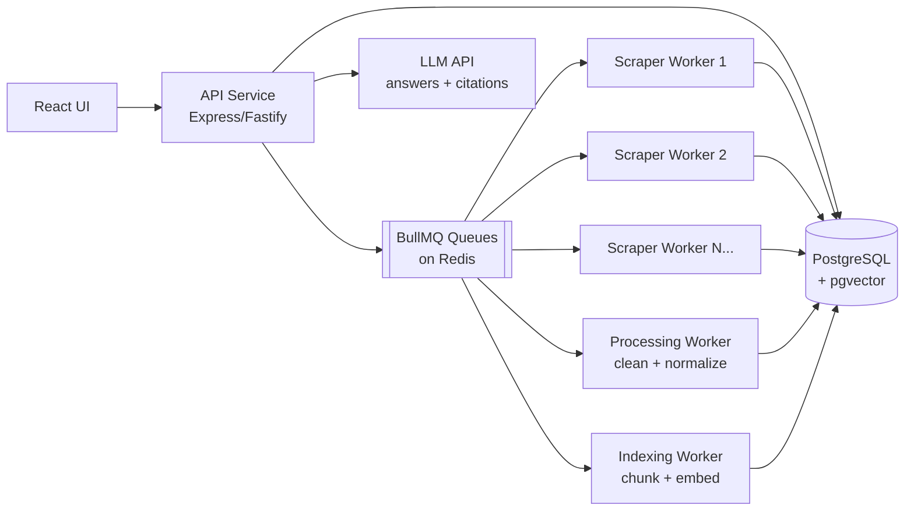

# Distributed RAG-Based Web Scraper Framework — Task Breakdown

**Deadline:** ~2026-07-25 (next week) · **Presented to:** OnRamp Academy
**Stack:** TypeScript · Node.js · React · PostgreSQL (+ Sequelize migrations, + pgvector) · Redis · BullMQ · Playwright · Docker

---

## Deliverables Checklist (what gets graded)

- [ ] Full source code: scraper workers, processing module, RAG integration, API, UI
- [ ] Video recording narrating each phase + reasoning behind key decisions
- [ ] Architecture diagram + flowchart/sequence diagram of the workflow
- [ ] Written report: tech justifications (each choice vs. at least 1 alternative), ethics/robots.txt compliance note
- [ ] Tested against **3 sites**: static HTML · JS-rendered · pagination/500+ pages
- [ ] Demonstrated: horizontal scaling (more workers = faster crawl) and fault tolerance (kill a worker mid-task, job recovers)

---

## Architecture (target)

**Pipeline:** URL enters `scrape` queue → worker fetches (Playwright or plain HTTP) → raw HTML stored in Postgres → `process` job cleans/normalizes → `index` job chunks + embeds into pgvector → API answers queries via retrieval + LLM with cited source URLs.

**Why this is "genuinely distributed":** each worker is an independent Docker container consuming from a shared Redis-backed queue. `docker compose up --scale scraper-worker=4` adds workers with zero code change; BullMQ's stalled-job detection reassigns jobs from crashed workers.

---

## Phase 0 — Decisions & Setup (Day 1)

- [x] **0.1** Decide the open questions (see "Decisions Needed" at the bottom)
- [x] **0.2** Init monorepo (npm workspaces + **Turborepo**): `packages/shared`, `apps/api`, `apps/scraper-worker`, `apps/processing-worker`, `apps/indexing-worker`, `apps/web`
- [x] **0.3** TypeScript config (strict), ESLint + Prettier, base `tsconfig` shared across packages
- [ ] **0.4** GitHub repo, push early, commit often (clear commit history is a requirement) — *local repo initialized + first commit done; create GitHub repo and `git remote add origin … && git push`*
- [x] **0.5** GitHub Actions CI: lint + typecheck + tests on every push (`.github/workflows/ci.yml` — runs once pushed to GitHub)
- [x] **0.6** `docker-compose.yml`: postgres (`pgvector/pgvector:pg16` image), redis (`redis:7-alpine` image), api, workers, web — one Dockerfile per app
- [x] **0.7** `.env.example` + config module (validated with zod, in `packages/shared`)

## Phase 1 — Database Schema & Migrations (Day 1–2)

Sequelize + `sequelize-cli` migrations (never `sync()` — migrations are the requirement).

- [x] **1.1** Migration: enable `vector` extension (pgvector)
- [x] **1.2** `sites` — id, name, base_url, robots_txt (cached), crawl_delay_ms, allowed (bool), render_mode (static | js)
- [x] **1.3** `pages` — id, site_id, url (unique), status, content_hash, last_crawled_at, http_status
- [x] **1.4** `page_versions` — id, page_id, version_no, raw_html (or path), content_hash, fetched_at
      → satisfies the "versioning, no silent overwrite" requirement
- [x] **1.5** `documents` — id, page_version_id, title, cleaned_text, structured_data JSONB (tables etc.), content_type
- [x] **1.6** `chunks` — id, document_id, chunk_index, text, token_count, embedding `vector(1536)` (dimension depends on embedding model), tsvector column for keyword search
- [x] **1.7** Indexes: HNSW (or IVFFlat) on embedding, GIN on tsvector, unique on (page_id) url
- [x] **1.8** Seed script for the 3 target sites — *2 of 3 seeded (books.toscrape.com, quotes.toscrape.com/js); 3rd real-world site TBD in Phase 3 per D1*

## Phase 2 — Queue Infrastructure (Day 2)

- [ ] **2.1** `packages/shared`: BullMQ queue definitions + typed job payloads — queues: `scrape`, `process`, `index`
- [ ] **2.2** Retry policy: 3–5 attempts, exponential backoff with jitter
- [ ] **2.3** **Dead-letter mechanism**: on final failure move job to a `dead-letter` queue + `failed_jobs` table with error details (explicit requirement)
- [ ] **2.4** Per-domain rate limiting: BullMQ group/limiter or a Redis token bucket keyed by domain, honoring `crawl_delay_ms`
- [ ] **2.5** Bull Board dashboard mounted on the API (`/admin/queues`) — great for the demo video
- [ ] **2.6** Graceful shutdown (SIGTERM → finish/release current job) so killed workers demo cleanly

## Phase 3 — Scraper Workers (Day 2–3) ← biggest module

- [ ] **3.1** Fetcher abstraction: `staticFetcher` (undici/fetch) + `jsFetcher` (Playwright, headless Chromium in the container) selected by `site.render_mode`
- [ ] **3.2** robots.txt: fetch + cache per site, check every URL (`robots-parser`), respect `Crawl-delay`; skip disallowed URLs and log the decision (for the compliance note)
- [ ] **3.3** Link discovery: extract same-domain links (Cheerio), normalize URLs, enqueue new ones — handles pagination/infinite-scroll site (Playwright scroll loop for infinite scroll)
- [ ] **3.4** Deduplication: SHA-256 content hash — unchanged hash on re-crawl ⇒ skip processing (incremental re-crawls, explicit requirement)
- [ ] **3.5** Store raw HTML → `page_versions`, then enqueue `process` job
- [ ] **3.6** Failure handling: timeouts, HTTP 429/503 → exponential backoff; simulate/handle temporary IP block (treat repeated 403/429 as domain-level cooldown)
- [ ] **3.7** Crawl depth / max-pages limits per site; crawl-session tracking (started, pages done, errors) for the UI
- [ ] **3.8** **Horizontal scaling demo:** script that enqueues N URLs, measures wall-clock with 1 vs 4 workers → table/chart for the report

## Phase 4 — Processing Worker (Day 3–4)

- [ ] **4.1** Boilerplate stripping: Mozilla Readability (jsdom) for article extraction + Cheerio fallback; remove scripts/nav/footers
- [ ] **4.2** Extract **more than one content type**: body text + HTML tables (→ structured JSON) + document links (explicit requirement)
- [ ] **4.3** Normalize into `documents` with zod schema validation before insert
- [ ] **4.4** Enqueue `index` job on success

## Phase 5 — RAG: Indexing + Retrieval (Day 4–5)

- [ ] **5.1** **Chunking — must be deliberate, not fixed-length** (explain trade-offs in report): recursive structure-aware splitting (headings → paragraphs → sentences), ~400–600 tokens with 10–15% overlap; keep heading path as chunk metadata
- [ ] **5.2** Embeddings: batch-embed chunks, store in pgvector (see Decision D2 for provider)
- [ ] **5.3** Retrieval function: query → embed → cosine similarity top-k (pgvector `<=>`)
- [ ] **5.4** Hybrid search: combine vector similarity + Postgres full-text (tsvector) — e.g. Reciprocal Rank Fusion; gives you "keyword and semantic" search from one store
- [ ] **5.5** Answer generation: top-k chunks + system prompt → LLM; require inline citation markers `[1] [2]` mapped to source URLs; return `{ answer, citations: [{url, title, snippet}] }`
- [ ] **5.6** **Multi-source synthesis**: retrieval pulls from multiple sites; verify with test queries whose answers span ≥2 scraped sources (explicit requirement)
- [ ] **5.7** Measurable retrieval quality: small golden set (~15–20 question → expected-source pairs); measure hit-rate@k / MRR; report the numbers

## Phase 6 — API Service (Day 5)

Framework: Express or Fastify (see Decision D3). Endpoints (all required):

- [ ] **6.1** `GET /api/sites`, `POST /api/sites/:id/crawl` — trigger/inspect crawls
- [ ] **6.2** `GET /api/pages`, `GET /api/pages/:id/raw` — raw scraped data (+ versions)
- [ ] **6.3** `GET /api/documents`, `GET /api/documents/:id` — processed content
- [ ] **6.4** `GET /api/search?q=&mode=keyword|semantic|hybrid` — search endpoint
- [ ] **6.5** `POST /api/ask` — RAG Q&A with citations (source URLs)
- [ ] **6.6** `GET /api/stats` — queue depths, pages crawled, chunks indexed (feeds the UI dashboard)
- [ ] **6.7** OpenAPI/Swagger doc, zod request validation, error middleware, rate limiting

## Phase 7 — React Web UI (Day 5–6)

Vite + React + TS; keep it clean but simple ("basic interface" per the brief).

- [ ] **7.1** Dashboard: crawl stats, queue status (poll `/api/stats` — "real-time data access")
- [ ] **7.2** Search page: query box, mode toggle (keyword/semantic/hybrid), results with source links
- [ ] **7.3** Ask page: question → streamed or spinner answer + clickable citations
- [ ] **7.4** Pages browser: raw vs processed view, version history of a page

## Phase 8 — Distribution, Fault Tolerance & Demos (Day 6)

- [ ] **8.1** `docker compose up --scale scraper-worker=4` works; document it
- [ ] **8.2** **Fault-tolerance demo:** `docker kill` a worker mid-crawl → show job marked stalled → picked up by another worker (record for video)
- [ ] **8.3** Dead-letter demo: enqueue a permanently-failing URL → lands in DLQ after N retries
- [ ] **8.4** Scaling benchmark (from 3.8) executed and charted
- [ ] **8.5** Run the full pipeline against all 3 target sites; save sample data as deliverable

## Phase 9 — Report, Diagrams & Video (Day 6–7)

- [ ] **9.1** `REPORT.md` (or PDF): overview, architecture, **tech justifications with ≥1 rejected alternative each** (Node vs Python, BullMQ vs RabbitMQ/Kafka, pgvector vs Pinecone/Qdrant, Playwright vs Puppeteer/Selenium, Sequelize vs Prisma, Express vs NestJS, chunking strategy trade-offs)
- [ ] **9.2** Architecture diagram + sequence diagram: "URL → queue → scraped → processed → indexed → queried" (Mermaid or Excalidraw)
- [ ] **9.3** Ethics/compliance note: robots.txt handling, rate limits used, ToS check per site
- [ ] **9.4** Retrieval-quality numbers (from 5.7)
- [ ] **9.5** Record video: walk each phase, show scaling + failure demos, explain decisions
- [ ] **9.6** README: setup instructions, `docker compose up`, env vars

---

## Suggested 7-Day Schedule

| Day | Focus |
|-----|-------|
| 1 | Phase 0 + 1 (repo, Docker, CI, schema/migrations) |
| 2 | Phase 2 + start 3 (queues, static scraping) |
| 3 | Phase 3 (Playwright, robots.txt, dedup, retries) |
| 4 | Phase 4 + start 5 (processing, chunking, embedding) |
| 5 | Phase 5 + 6 (retrieval, RAG answer, API) |
| 6 | Phase 7 + 8 (UI, scaling & failure demos) |
| 7 | Phase 9 (report, diagrams, video) + buffer |

---

## Decisions (locked in 2026-07-18)

| # | Decision | Choice |
|---|----------|--------|
| D1 | Target websites | `books.toscrape.com` (static + 500+ pages: 50 catalogue pages + 1000 book detail pages), `quotes.toscrape.com/js/` (JS-rendered), + one real-world static site (e.g. a blog/docs site — pick during Phase 3) |
| D2 | LLM + embeddings | **OpenAI for both**: `text-embedding-3-small` (1536 dims → `vector(1536)`) + `gpt-4o-mini` for answers. Needs `OPENAI_API_KEY` in `.env` |
| D3 | API framework | **Express** |
| D4 | Raw HTML storage | In Postgres (`page_versions.raw_html` TEXT) — simplest, fine at this scale |
| D5 | Distribution scope | Docker Compose with `--scale scraper-worker=N` — independent container instances |
| D6 | Monorepo manager | npm workspaces + **Turborepo** (task orchestration + caching; pnpm not installed) |
| D7 | Streaming answers | Optional stretch goal — add SSE only if time remains on Day 6 |

**Report note:** each of these must appear in the report with at least one rejected alternative (e.g. OpenAI vs Ollama, Express vs NestJS, pgvector vs Pinecone, BullMQ vs RabbitMQ, Playwright vs Selenium, Sequelize vs Prisma).
